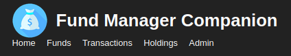
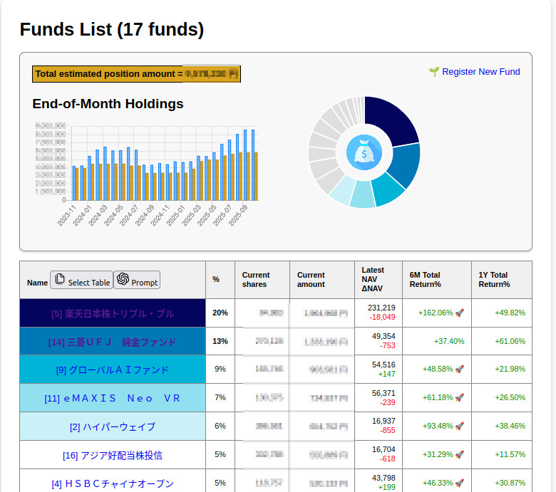
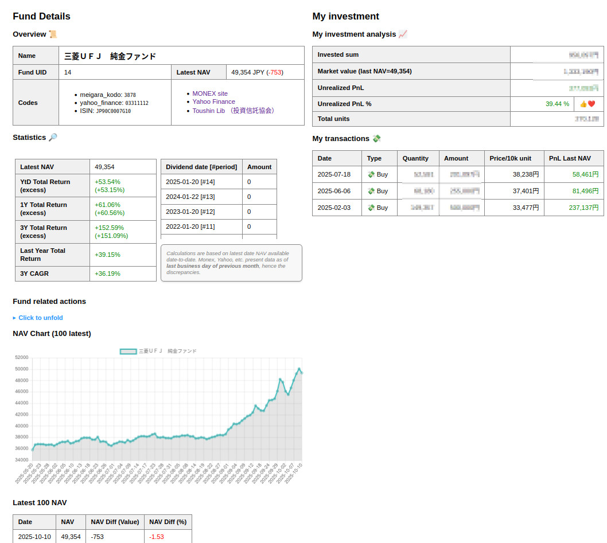

# FundManagerCompanion
A web app to help you keep track of your funds investments and performance. Mainly if you're in Japan I think.




## Concept
I want to be able to keep track of when I invested on funds, and see the compound performance of the funds. Today my fund management site gives me a number and that's it.

## Portfolio status

What you invested in, each fund PnL, weight, percentage of your portfolio.



## Each fund details

Static info, code,s returns, dividends, investment PnL, transactions history, NAV graph and details, etc.



# Quotations API
Mutual Funds have a price daily (NAV Net Asset Value) published at market closure at end of day (except ETF I know). Getting consistently prices from all of them will be a chore since I don't plan to pay for an API provider. 

## Investment Trust Association Japan 投資信託協会

THE reference, all asset managers in Japan must share the NAV to them every evening around 6~8pm (my years in asset management are getting blurry).

You get every fund, and you can download the fund's daily NAV since inception via CSV. This is what I use in the app for the **WHOLE NAV history**. 

https://toushin-lib.fwg.ne.jp/FdsWeb/FDST000000

## MUFG Funds
Bravo guys, you have a free API that does not require registration!😍 WOW. Just WOW.
- RTFM https://www.am.mufg.jp/tool/webapi/
- Sample: `https://developer.am.mufg.jp/fund_information_latest/association_fund_cd/03311112` returns a nice JSON with latest details for their 三菱ＵＦＪ 純金ファンド
- You have latest NAV, ISIN, etc.

To find the "association fund code", search by name on Yahoo Finance (https://finance.yahoo.co.jp), that's the number.

## The rest of the Asset managers
... do rarely have an API, always a page (regulatory) but not the easiest to parse.

Seems that the Nikkei Journal has a page with all needed, no paywall, and parseable (in beautitulSoup we trust).
See `https://www.nikkei.com/nkd/fund/?fcode=0131106B` or `https://www.nikkei.com/nkd/fund/?fcode=03311112` (same fund as above) BUT THE PRICES ARE DELAYED (now 21:30 and still D-1 prices)

Also Yahoo Finance is similar with `https://finance.yahoo.co.jp/quote/0131106B` and `https://finance.yahoo.co.jp/quote/03311112` (same fund as above) AND PRICES SEEM LATEST (at 21:30 I'm seeing day D closure prices)

I'm scrapping last ~20 NAV from Yahoo Finance price history page when you click **Update HISTORICAL NAV**.

# Financial indicators

## Fund NAV return
Simplest performance calculation:

(NAV end - NAV start) / Nav Start * 100%

## Fund NAV Total return
Better, including the dividends paid by fund:

((NAV end - NAV start) + Dividends paid over period) / Nav Start * 100%

## Fund NAV Total Excess return
Even better, including the dividends paid by fund minus the risk free interest rate:

(((NAV end - NAV start) + Dividends paid over period) / Nav Start * 100%) - Risk Free Interest rate

# Technical stuffs

## Build Docker

`docker build -t fund_manager_companion_image .`

## Run Docker (non detached)

You will need the data/data.db file. It's not in the image so has to be mapped from the outside on start.
```bash
#maps HOST /path/to/your/host/database.db to the expected /app/data/data.db in the container
#will listen locally on port 54321 (port 5000 in the container)
docker run -p 54321:5000 -v /path/to/your/host/database.db:/app/data/data.db fund_manager_companion_image
```

Or you can mount a whole folder to keep the backups there too.
```bash
#maps HOST /path/to/your/host/database.db to the expected /app/data/data.db in the container
#will listen locally on port 54321 (port 5000 in the container)
docker run -p 54321:5000 -v /path/to/your/host/fmc_data:/app/data fund_manager_companion_image
```

## Run Docker (detached)

This is the one you want:
```bash
#maps HOST /path/to/your/host/fmc_data FODLER to the expected /app/data in the container
#will listen locally on port 54321 (port 5000 in the container)
docker run -d -p 54321:5000 -v /path/to/your/host/fmc/data:/app/data --restart unless-stopped --name fmc-container fund_manager_companion_image
```